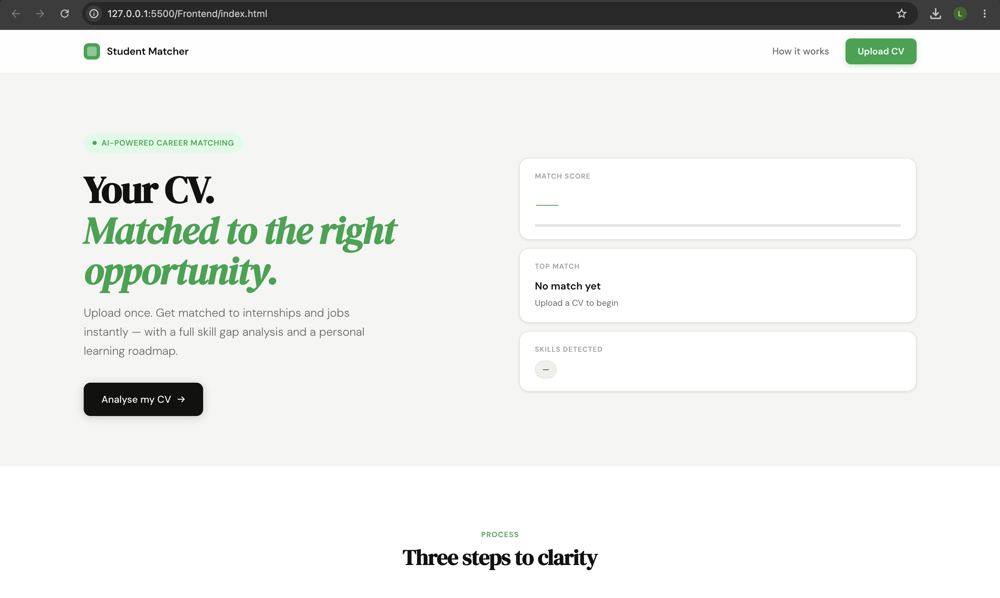
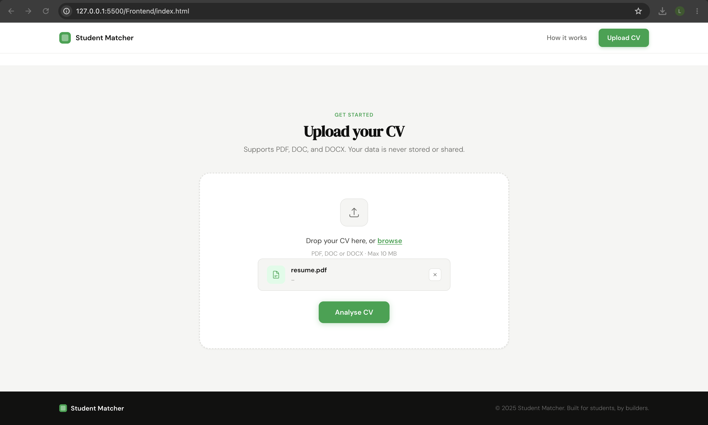
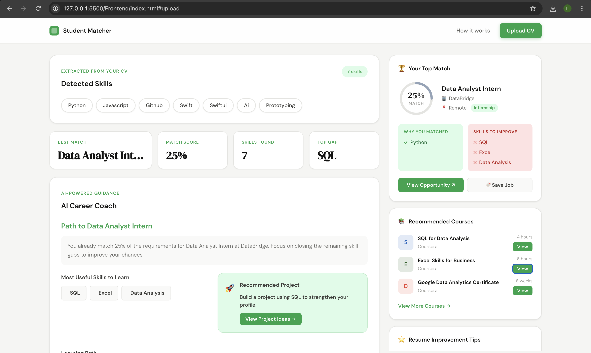

# 🚀 Student Matcher

  <strong>AI-Powered Career Matching Platform for Students</strong>

  Discover internships, jobs, training programs, and graduate opportunities tailored to your skills and experience.

  
  
  
  
  

---

## 📖 Overview

Student Matcher is an AI-powered platform designed to help students discover career opportunities that align with their skills, experience, and interests.

Users can upload a CV and receive personalized recommendations for internships, jobs, training programs, and graduate opportunities.

---

## ✨ Key Features

### 📄 CV Analysis

* Upload and analyze resumes
* Extract skills automatically
* Generate career insights

### 🎯 AI Career Matching

* Match students with relevant opportunities
* AI-powered match scores
* Explain why a role is a good fit

### 📈 Career Gap Analysis

* Identify missing skills
* Highlight growth opportunities
* Recommend learning paths

### 🎓 Personalized Learning

* Recommend courses based on skill gaps
* Support career development planning

---

## 🛠️ Tech Stack

| Technology | Purpose            |
| ---------- | ------------------ |
| Python     | Backend Logic      |
| Flask      | Web Framework      |
| HTML       | Frontend Structure |
| CSS        | Styling            |
| JavaScript | Interactivity      |
| GitHub     | Version Control    |

---

## 🎯 Project Vision

Student Matcher aims to bridge the gap between students and career opportunities by providing intelligent recommendations and actionable career insights.

---

## 🚧 Planned Features

* LinkedIn Profile Integration
* Real-Time Internship APIs
* AI Career Coach
* Advanced Skill Gap Analysis
* Recruiter Dashboard

---
## 📸 Screenshots

### Homepage

### Upload CV

### Results

---

## 👩‍💻 Developed By

**Lana Alkaisy**

For questions, feedback, or collaboration opportunities, feel free to connect via LinkedIn.
